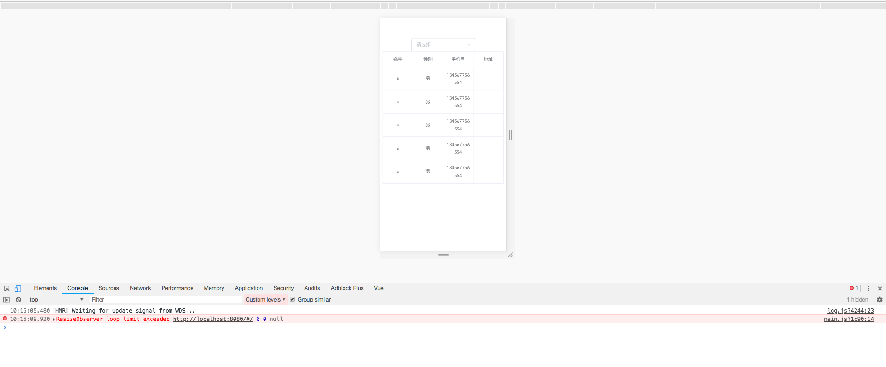

# test

> A Vue.js project for reproducing ResizeObserver loop limit exceed error when using Element UI `el-table`

## Build Setup

``` bash
# install dependencies
npm install

# serve with hot reload at localhost:8080
npm run dev
```

## Explanation

The `window.onerror` function is redefined in `main.js` as follows:
```js
window.onerror = function(message, source, lineno, colno, error){
  console.error(message, source, lineno, colno, error)
}
```

## How to reproduce ?

Try to resize the window until the phoneNumber starts wrapping to two lines, it will trigger a log output to Console

## Image



